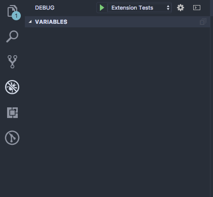

# Contributors Guide

The following is a good set of guidelines on contributing to this project. I am fully accepting any positive change into the project that will make it faster, more maintainable, and anything that increases the satisfaction of using it.

## Where to start

If you want to work on something, look in the Issues tab first. Both a benefit to see that your contribution isn't already being worked on by someone else, but also to make sure that it is an appropriate contribution before diving into it.

If you want to make something and there isn't an issue on it, post one and I will likely look at it within 24 hours max.

## Unit Tests

We use the VS Code testrunner for E2E tests which uses Mocha behind the scenes. To run all of the tests, open the Debug tag in VS Code and switch to the `Extension Tests` launch option.

## Linting

This project uses TSLint for linting. To keep consistency for code style, I have integrated it so builds will fail if TSLint doesn't pass. I highly recommend the [TSLint VS Code Extension](https://marketplace.visualstudio.com/items?itemName=eg2.tslint) to see visible warnings / errors in the editor itself if the code style is incorrect.

## Submitting PRs

Once you have completed your contribution, feel free to submit a PR. I will pull down your branch and test it to confirm the change works and if any further changes need to happen before being merged in. Similar with issues, As long as I am not on vacation, I should get back to your contribution within 24 hours.
