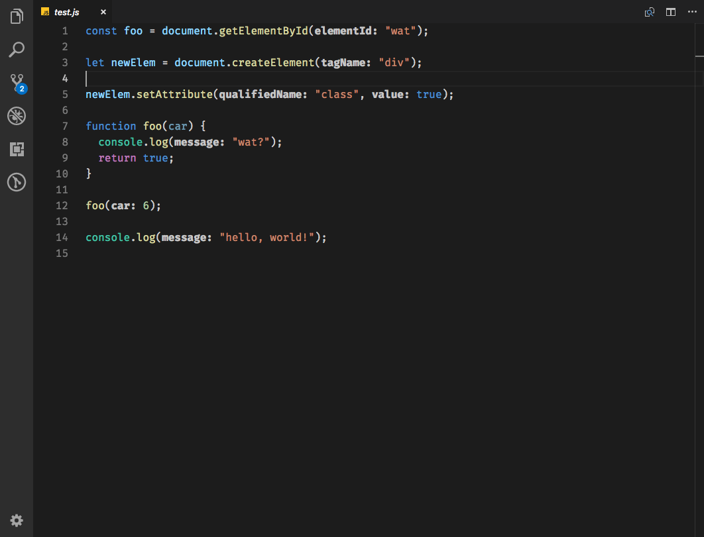

# JS / TS Parameter Annotations for Visual Studio Code

vscode-js-annotations goes through any Javascript or Typescript file and inserts parameter annotations into all function calls so it is easily noticable on what a particular parameter is.

## Settings

There currently is a few configurable settings in the extension

| Name | Description | Default |
|-------|------------|---------|
| `jsannotations.enabled`  | Enable JS Annotations | true |
| `jsannotations.hideIfEqual` | Hide annotation if argument name matches parameter name | true |
| `jsannotations.hideInvalidAnnotation` | Hide annotations for invalid params | true |
| `jsannotations.hideDiagnostics` | Hide red squiggles under invalid parameters | false |
| `jsannotations.fontWeight` | Annotation styling of font-weight CSS property | "400" |
| `jsannotations.fontStyle` | Hide annotation if argument name matches parameter name | "italic" |

## Themable Colors

JS Annotations provides a single themable color being the color of what the annotation should be:

| Name | Description |
|------|-------------|
| `jsannotations.annotationForeground` | Specifies the foreground color for the annotations |

## Contributors 👨‍💻 👩‍💻

Thanks to the following Contributors who have helped with this project in any way

* Flavio Copes ([@flaviocopes](https://github.com/flaviocopes)) (PRs)
* Nigel Scott ([@Gruntfuggly](https://github.com/Gruntfuggly)) (Issues)
* Nurbol Alpysbayev ([@anurbol](https://github.com/anurbol)) (Issues)
* Sioxas ([@sioxas](https://github.com/Sioxas)) (Issues)